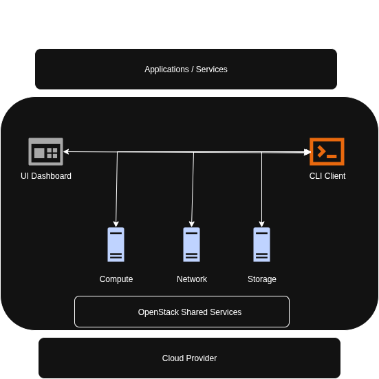
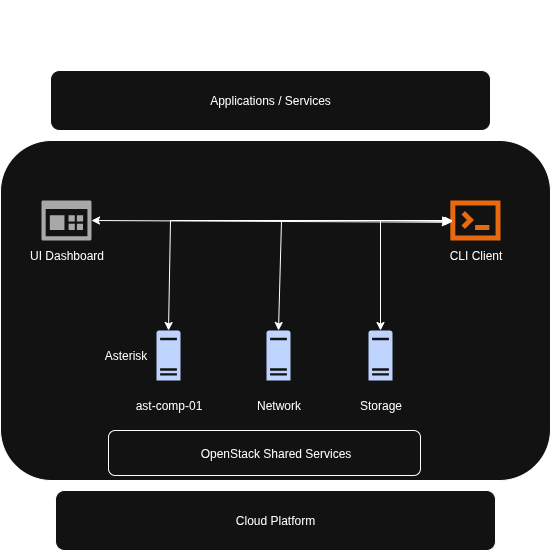
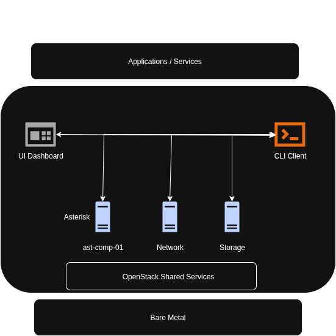

# Cascade

Cascade is an open source project for designing, deploying, and administering virtual contact centers and internal communications using OpenStack infrastructure. The project addresses both Contact Center as a Service (CCaaS) and Unified Communications as a Service (UCaaS) models.
The initial goal is to provide the development of omnichannel contact centers and unified communications for small to medium organizations using OpenStack and open source software.

Cascade will address the need to cost effectively host and operate virtual contact centers. Features will include Chat, APIs, Messaging, Auditing, Monitoring, Data Analytics etc. 
The only limits are available and provisioned hardware by users.
Customer engagement is a high priority for delivering quality customer experiences by using cascade. Data metrics will be provided as logged and analyzed data for ensuring auditing and reporting.

## Project Mission

The project aligns with the OpenStack Mission:

1. The project furthers the OpenStack mission by providing a cloud service, Contact Center as a Service (CCaaS);

2. Furthers the OpenStack mission by providing a service for operators of OpenStack clouds;

3. Will provide deployment and lifecycle management tooling for OpenStack;

4. Will provide packaging recipes to be used when deploying OpenStack;

5. Will provide client-side tools to enable users to interact with OpenStack (ie OpenStackCLI; or

6. Will provide integration to enable adjacent systems to interoperate with OpenStack.

### The project will follow the OpenStack way (“the 4 opens”):

## Open Source

1. The proposed project uses an open source license, Apache v2.0 license.

2. The project will not have library dependencies which effectively restrict how the project may be distributed or deployed

## Open Community

The leadership is chosen by the contributors to the project:

1. Project meetings will take place in public and in IRC, #openstack-meeting-alt. They will be logged and published.

2. The project shall provide a level and open collaboration playing field for all contributors.
   
3. The project shall not benefit a single vendor, or a single vendors product offerings; nor advantage contributors from a single vendor organization due to access to source code, hardware, resources or other proprietary technology available only to those contributors.

4. The project publicly participated in the Fall of 2026 PTG https://ptg.opendev.org/ptg.html.

## Open Development

1. The project will use public code reviews on the OpenStack infrastructure

2. The project will have core reviewers and will adopt a test-driven gate in the OpenStack infrastructure for changes

3. The project provides liaisons that serve as contacts for the work of cross-project teams in OpenStack

4. The project cooperates with existing projects rather than gratuitously competing or reinventing the wheel

5. The project adopts technology and patterns used by existing OpenStack projects

## Open Design

1. The project direction will be discussed at the Design Summit and/or on public forums

2. The project uses the openstack-dev ML to discuss issues (to be verified)

3. The project ensures basic interoperability with the rest of OpenStack: User-facing API services should support Keystone for discovery and authentication.

4. The project has an active team of one or more contributors.

5. The project participates in any goals specified by the TC, as defined by OpenStack-wide Goals. Any existing goals that are not met should be prioritized and completed within the first year of a team joining.

6. The project meets any policies that the TC requires all projects to meet (ie. Project Testing Interface).

## Generic OpenStack Architecture

## Cascade Cloud Architecture

## Cascade VirtualBox Architecture

## Cascade Bare Metal Architecture

## Initial Sub-projects to be researched and integrated

1. VoiP, PBX: Ex. Asterisk 

2. PBX Dashboard: Ex. freePBX: 

## Possible sub-projects

4. Video Calling and Online Meetings Ex. Jitsi 

5. Social Media: Ex. Mastodon

6. Customer Relationship Management: Ex. SuiteCRM

7. Web browsing: Ex. Ex. Firefox Browser 

8. Open Source AI Agents Ex. Klaire

9. Instant Messaging: Ex. Jabber

## Immediate and Future Features

1. All-in-1 Deployment

2. APIs

3. UI Dashboard

4. Phone Branch Exchange (PBX)

5. Instant Messaging (IM)

6. Video Calling

7. Email

8. Customer Relationship Management (CRM)

9. SMS

10. Security

## Target Markets/Initial Users

1. Startup Companies

2. Nonprofit Organizations 

3. Small and Medium Companies (SMB)

## Proprietary CCaaS Products to be researched

1. Amazon Connect https://aws.amazon.com/connect/
2. Cisco Webex: https://www.webex.com/
3. dialpad https://www.dialpad.com/
4. Five9: https://www.five9.com/
5. Google CCaaS: https://cloud.google.com/solutions/contact-center-ai-platform?hl=en
6. Zoom https://www.zoom.com/
8. Microsoft Teams: https://www.microsoft.com/en-us/microsoft-teams/group-chat-software/
9. Miratech: https://miratechgroup.com/
10. NICE https://www.nice.com/
11. RingCentral: https://www.ringcentral.com/
12. Twilio: https://www.twilio.com/
    

## Etherpad Meetings
https://etherpad.opendev.org/p/250815-cascade-meeting
https://etherpad.opendev.org/p/projectcascade-250829meeting
https://etherpad.opendev.org/p/projectcascade-250912meeting
https://etherpad.opendev.org/p/projectcascade-250926-meetingnotes
https://etherpad.opendev.org/p/oct2025-ptg-cascade
